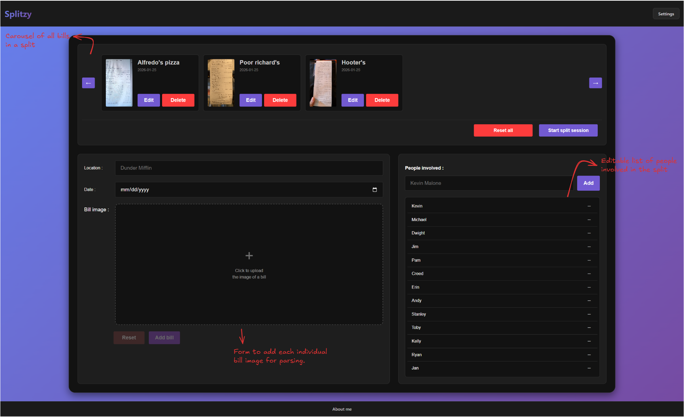
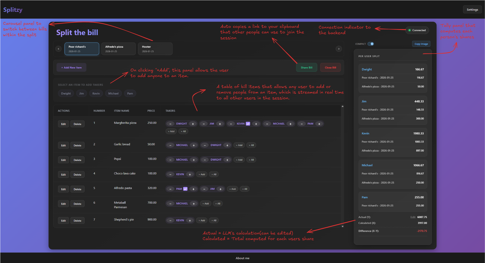

# Splitzy

A real-time collaborative bill splitter that makes dividing expenses with friends and family effortless. Upload your receipt, invite your group, and split the bill together live.

### NOTE : I'm self hosting this app. It might not be available all the time.
Visit - [Splitzy](https://splitzy.dak-shin.com/)

---

## What silly problem am I solving??

Have you ever gone out with your friends for dinner and suddenly someone is stuck splitting a restaurant bill? Don't worry, **Splitzy** is here to save the day! Splitting a restaurant bill shouldn't require a spreadsheet. Calculating who owes what, accounting for shared items, and tracking everyone's share of the bill is quite tedious and error-prone. **Splitzy** eliminates the annoying task by turning bill-splitting into a seamless, collaborative experience.

---

## Some note-worthy features

-   **Receipt Scanning**: Upload a photo of your bill and let a GPU burning entity extract all the items automatically.
-   **Real-Time Collaboration**: Share a session link with your group. Everyone can join claim items and see updates instantly thanks to WebSockets.
-   **Automatic Tally**: See a live breakdown of what each person owes as items are assigned.
-   **Multi-Bill Support**: Splitting across multiple receipts? No problem. Manage them all in one session.

---

## Screenshots

### Home Page
_Upload bills and add participants to start a new session._

### Split-up Page
_Assign items to takers and view the real-time tally._

---

## Tech Stack

| Layer        | Technology                                      |
| :----------- | :---------------------------------------------- |
| **Frontend** | React, TypeScript, Vite                         |
| **Backend**  | Go (Golang)                                     |
| **Real-Time**| WebSockets                                      |
| **AI/OCR**   | Google Gemini (for receipt parsing)             |
| **Styling**  | Vanilla CSS with a premium dark theme           |

---

## 📜 License

MIT

---

> No more, "who had the garlic bread?" debates.
